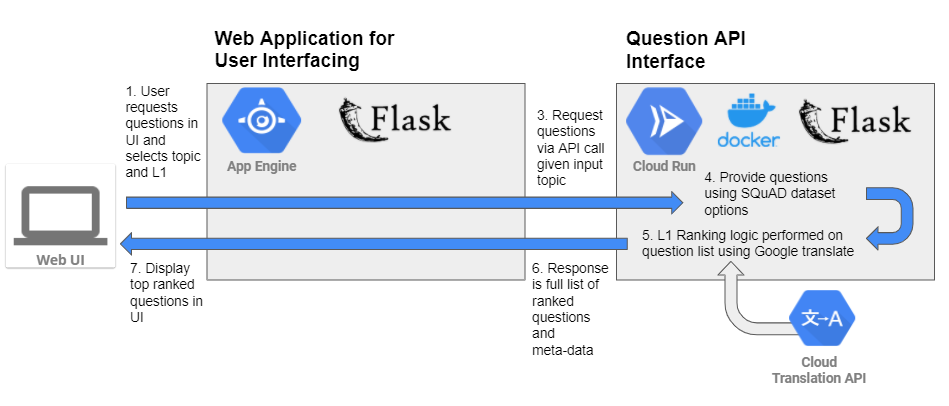

# ESL-L1-question-targeting
GT OMSCS CS6460 Educational Technology Project: ESL Reading Comprehension Question Interface with L1 Targeting

## Architecture
Architecture is broken into two components: Web UI front end hosted with Google Cloud Platform (GCP) App Engine, and a backend API hosted with GCP Cloud Run. Both components are written in Python Flask

### Question Generation Model: ERNIE
The question generation functionality is implemented using a pre-trained model from https://github.com/PaddlePaddle/ERNIE

This model was chosen as it is ranked highest in BLEU 4 score on the SQuAD dataset according to https://paperswithcode.com/sota/question-generation-on-squad11. This model is also appropriate as it provides the pre-trained model and the library to interface with it, which will allow for ease of integration.

### Sample Data
20 sample data files under the path ./data sourced from https://www.myenglishpages.com/site_php_files/reading.php

These reading comprehension passages are relatively short and at a beginner/intermediate reading level and cover a wide range of context domains. The sample passages from the source website contain some human created questions which can be used as a comparison tool for the generated questions.

More test data will be added as needed to test performance on for higher difficulty and longer passages. Future work: robust testing using Stanford NLP groups SQuAD 1.1 dataset: https://rajpurkar.github.io/SQuAD-explorer/explore/1.1/dev/ 

## To run code in GCP Cloud Run

