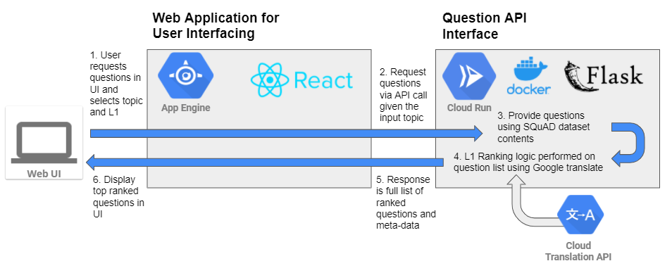
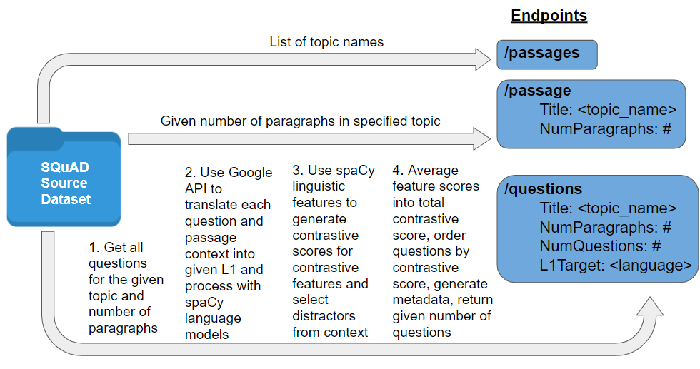
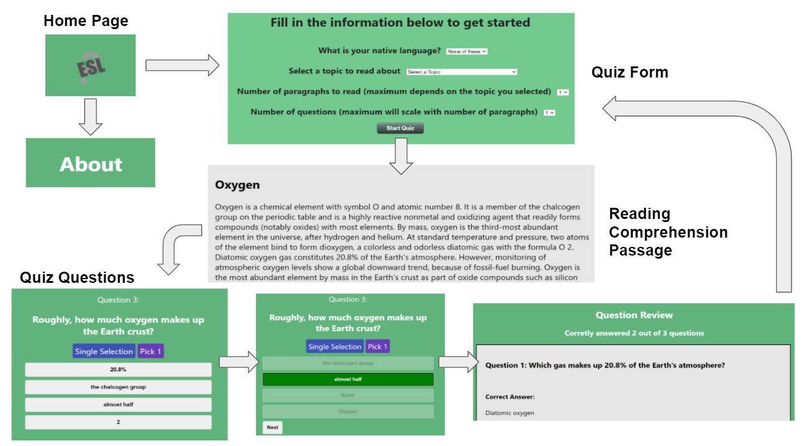

# ESL-L1-question-targeting
GT OMSCS CS6460 Educational Technology Project: ESL Reading Comprehension Question Interface with L1 Targeting. For more context on the purpose and design of this project, see the full proposal here: https://drive.google.com/file/d/1D6FmIAyxu0lAiTcQVQZiAyAmF0SqHFsV/view?usp=sharing

## What is L1 Targeting?
L1 is the term for an English as a Sencond Language (ESL) learner's native language. Research has shown that 42% of ESL student error can be traced to L1 influence [cite]. The theory which is the basis of this project is that providing extra practice question resources which specifically target areas of English which are different than a student's L1 can help to prevent these L1-influenced errors and improve the student's ESL learning.

## Project Goal
This project aims to provide a platform for ESL students to receive and answer questions on reading comprehension passages with a filter for the specific questions which would be most useful for that particular student to study based on their given native language (L1).

## Architecture
Architecture is broken into two components: Web UI front end hosted with Google Cloud Platform (GCP) App Engine, and a backend API hosted with GCP Cloud Run. Both components are written in Python Flask



# L1 Targeting Question API
The backend API supplies the question data to users, performs the contrastive scoring algorithm based on L1, and returns the ranked questions and metadata. Below is the API logical flow:


## How is L1 Targetting Performed?
Given a set of questions related to an input passage the L1 targetter ranks and re-orders the questions based on a contrastive linguistic score generated by the system. 

This contrastive score is in the range from 0 to 1 (reported as a percentage) and denotes how difficult the question might be for a specific L1 based on the liguistic comparison method of contrastive analysis. In practical terms, this score measures the linguistic variation between the question and surrounding context in English and in the L1 language. This is based on the assumption that questions with higher varience between the English and L1 texts are more difficult for speakers of that L1.

To calculate this score, this system utilizes the Google Translate API to translate the question and surrounding context into the given L1. Both versions of the text have linguistic features extracted using the pre-trained language models from SpaCy and the system uses these to perform the linguistic analyses described below. All of the features are then averaged to gain the total contrastive score for that question.

## Linguistic Features for Contrastive Scoring
- Part of Speech Word Ordering: Compare the part of speech for the words at each position in the sentence between English and L1. This will provide a metric for how the words are reordered during translation.
- Semantic Similarity: Using word embeddings of the sentences in each language, get the semantic similarity metric between the languages. This will measure a general representation on how the word meanings in the sentence fit into their respective languages in context.
- Verb Form Analysis: A simple metric to determine the difference in verb conjugation between languages. This is performed by getting the lemma (word root) of the main verb in the sentence and comparing this difference across languages.
- Dependency Distance: This feature uses the dependency parsing information in the sentence to determine the sentence root, subject, and object. The difference in positions of these words in the sentence are then compared between languages. This will measure the ordering of SVO vs. SOV etc.

## Sample Question Response
```json
{
    "answer": "water",
    "answer_index": 465,
    "context": "Many major classes of organic molecules in living organisms, such as proteins, nucleic acids, carbohydrates, and fats, contain oxygen, as do the major inorganic compounds that are constituents of animal shells, teeth, and bone. Most of the mass of living organisms is oxygen as it is a part of water, the major constituent of lifeforms. Oxygen is used in cellular respiration and released by photosynthesis, which uses the energy of sunlight to produce oxygen from water. It is too chemically reactive to remain a free element in air without being continuously replenished by the photosynthetic action of living organisms. Another form (allotrope) of oxygen, ozone (O\n3), strongly absorbs UVB radiation and consequently the high-altitude ozone layer helps protect the biosphere from ultraviolet radiation, but is a pollutant near the surface where it is a by-product of smog. At even higher low earth orbit altitudes, sufficient atomic oxygen is present to cause erosion for spacecraft.",
    "distractors": [
        "earth",
        "ozone",
        "animal"
    ],
    "question": "From what does photosynthesis get oxygen?",
    "ranking_metadata": {
        "context_scores": [
            0.8380520895226778,
            0.5543715559567014,
            0.12504703511382287,
            0.39925236227987543
        ],
        "contrastive_score": 0.5392775058888883,
        "explanation": "This question recieved a total contrastive score of 53%. This score is considered a moderate level of contrast between English and your native language within the question and context. The most contrastive feature was part-of-speech word ordering within the context with a score of 83%, so the skill that may be more difficult for you in answering this question is low-level sentence structure.",
        "question_scores": [
            0.8333333333333334,
            0.5403541470951723,
            0.5,
            0.5238095238095238
        ]
    }
}
```

## How to Access the API
The deployed API can be found at https://esl-question-generator-qadjhsafva-ue.a.run.app/ and the endpoints can be hit using the [Postman collection](Scripts/L1-Target-Question-API.postman_collection.json) in this repository.

### To Run the API Locally
Follow these steps:

0. Prerequisite: Python 3 must be installed on your machine
1. Clone this repository with the command `git clone https://github.com/byramag/ESL-L1-question-targeting`
2. Move to the project root with the command `cd <path/to/install/location>/ESL-L1-question-targeting`
3. Ensure the required Python packages and data models are installed with the command `python Scripts/api_setup.py`
4. To run the API locally, use the command `python question_api.py` this will make the Flask API available at `http://0.0.0.0:8080/` and you can then hit the endpoints.
5. To easily test the local endpoints, you can use [Postman](https://www.postman.com/downloads/) and the import the [Postman Collection](Scripts/L1-Target-Question-API.postman_collection.json) provided. The local endpoints in the collection should be functional while you have the API running and you can change the request parameters in the "Body" tab of each endpoint.

### To deploy the API code in GCP Cloud Run
Anyone can deploy this API in their own GCP account by following this button and following the prompts. 

[](https://console.cloud.google.com/cloudshell/editor?shellonly=true&cloudshell_image=gcr.io/cloudrun/button&cloudshell_git_repo=https://github.com/byramag/esl-question-generator)

## Standard Question Data
The question dataset covers a wide range of context domains and is directed toward advanced ESL learners, involving relatively high question difficulty and longer passages. This large dataset is the Stanford NLP group's SQuAD 2.0 dataset and can be found here: https://rajpurkar.github.io/SQuAD-explorer/

A future enhancement of this work will include the ability to choose English difficulty level of the reading passage and questions. This will be enabled by including shorter reading passages with simpler grammar and simpler questions with easier answers. 

### Discussion on Question Generation
The original design of this system was to include a question generation functionality where users can input their own source text passage and have questions automatically generated from the text in real-time instead of being limited to the static SQuAD dataset currently used. This is now marked as a future work and is the highest priority for future implementation. This question generation will be implemented using a pre-trained model from https://github.com/PaddlePaddle/ERNIE. This model was chosen as it is ranked highest in BLEU 4 score on the SQuAD dataset according to https://paperswithcode.com/sota/question-generation-on-squad11. This model is also appropriate as it provides the pre-trained model and the library to interface with it, which will allow for ease of integration.


# Web User Interface
The simple web interface is built using React JS. The purpose of the interface is to allow users to interact with the question API, test themselves on the reading comprehension passages, and understad the metadata for why certain questions were targeted for their specific L1. A page-by-page wireframe of the UI is shown below:


The pages of the UI are as follows:
- Home Page: Landing page to welcome users and link to begin generating a quiz or get more information.
- About Page: Provides extra information about the project, describes goals, and provides links to source code and more information.
- Quiz Form Page: Includes a form to fill in the information needed select a reading comprehension passage and quiz including the following fields:
    - L1: The student's native language to target. Currently only the languages Chinese, French, Japanese, and Spanish are supported. The user may also select "None of These" to skip the L1 targeting step.
    - Topic: The topic area to read about. The current topics offer a wide variety of domains from Geology to EU Law to Computational Complexity Theory.
    - Number of paragraphs: This field defines the number of paragraphs to include in the reading passage and will scale based on the length of the topic selected.
    - Number of questions: This field sets the number of questions to include in the quiz and will scale to the number of questions available for the selected topic and in the selected number of paragraphs.
- Quiz Page: Includes the selected reading passage and users can scroll down to view and answer the targeted quiz questions based on the form responses selected. After completing the quiz, users can view their quiz results including the total correct answered, the correct answer and context where it was found, and an explanation for why this question was selected based on their given L1. After quiz completion, the users may go back to home or generate another quiz.

## How to Access the UI
The deployed UI is hosted in GCP App Engine and available here: https://abyram3cs6460.ue.r.appspot.com/
> :warning: Note that an ongoing bug is that if the UI has not recently been used, the cold startup of the API may cause the webpage to show a white screen for several seconds. This is because a large language model must be loaded and that takes some time. A future enhancement is to make this more asynchronous to improve user experience.

### To Host the React UI Locally
Follow these steps:

0. Node and npm must be installed on your machine. If not, follow the instructions here: https://docs.npmjs.com/downloading-and-installing-node-js-and-npm
1. (If project is not already cloned from API local steps above) 1. Clone this repository with the command `git clone https://github.com/byramag/ESL-L1-question-targeting`
2. Move to the project root with the command `cd <path/to/project/location>/ESL-L1-question-targeting`
3. Move to the UI folder with the command `cd web_UI/esl-question-ui`
4. Start the React app locally with `yarn start`. The UI will automatically open when ready or you can access it at the URL http://localhost:3000/
> :warning: Note that an ongoing bug is that if the API is on cold startup, the webpage may show a white screen for several seconds. This is because a large language model must be loaded on the backend. A future enhancement is to make this more asynchronous to improve user experience.
